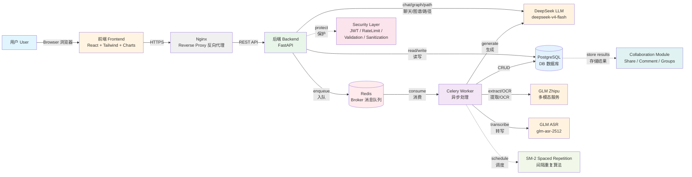

# Smart Study Assistant - 系统架构图

## 主架构图 (Main Architecture Diagram)



## 详细数据流架构图 (Detailed Data Flow Architecture)

```mermaid
graph TB
    subgraph "客户端层"
        User[用户<br/>User]
        Browser[浏览器<br/>Browser]
    end
    
    subgraph "前端层 Frontend Layer"
        React[React 18]
        Vite[Vite 构建工具]
        Tailwind[Tailwind CSS]
        Charts[图表组件<br/>Recharts]
        Router[React Router]
    end
    
    subgraph "网关层 Gateway Layer"
        Nginx[Nginx<br/>反向代理]
    end
    
    subgraph "后端服务层 Backend Service Layer"
        FastAPI[FastAPI 0.115]
        
        subgraph "API 路由"
            AuthAPI[/api/auth<br/>认证]
            UploadAPI[/api/uploads<br/>上传]
            ShareAPI[/api/share<br/>分享]
            ChatAPI[/api/chat<br/>聊天]
            AdminAPI[/api/admin<br/>管理]
        end
        
        subgraph "安全层"
            JWT[JWT 认证]
            RateLimit[API 限流]
            Validator[文件验证]
            Sanitizer[输入清洗]
        end
        
        subgraph "业务服务"
            AIService[AI 服务]
            EmailService[邮件服务]
            PermService[权限服务]
        end
    end
    
    subgraph "异步处理层 Async Layer"
        Redis[(Redis 7<br/>消息队列)]
        Celery[Celery 5.4<br/>Worker]
        
        subgraph "处理任务"
            ExtractTask[文本提取]
            OCRTask[OCR 处理]
            TranscribeTask[音频转写]
            GenerateTask[内容生成]
        end
    end
    
    subgraph "数据层 Data Layer"
        PostgreSQL[(PostgreSQL 16)]
        FileStorage[文件存储<br/>uploads/]
    end
    
    subgraph "AI 服务层 AI Services"
        DeepSeek[DeepSeek API<br/>文本生成]
        GLM[GLM API<br/>多模态]
    end
    
    User --> Browser
    Browser --> React
    React --> Vite
    React --> Tailwind
    React --> Charts
    React --> Router
    
    React -->|HTTPS| Nginx
    Nginx --> FastAPI
    
    FastAPI --> AuthAPI
    FastAPI --> UploadAPI
    FastAPI --> ShareAPI
    FastAPI --> ChatAPI
    FastAPI --> AdminAPI
    
    FastAPI --> JWT
    FastAPI --> RateLimit
    FastAPI --> Validator
    FastAPI --> Sanitizer
    
    FastAPI --> AIService
    FastAPI --> EmailService
    FastAPI --> PermService
    
    FastAPI --> PostgreSQL
    FastAPI --> FileStorage
    FastAPI --> Redis
    
    Redis --> Celery
    Celery --> ExtractTask
    Celery --> OCRTask
    Celery --> TranscribeTask
    Celery --> GenerateTask
    
    Celery --> PostgreSQL
    Celery --> FileStorage
    
    AIService --> DeepSeek
    Celery --> DeepSeek
    Celery --> GLM
```

## 简化横向架构图 (Simplified Horizontal Architecture)

```
用户 ──Browser──> 前端 (React + Tailwind + Charts) ──HTTPS──> Nginx (Reverse Proxy) ──REST API──> 后端 (FastAPI) ──chat/graph/path──> DeepSeek LLM (deepseek-v4-flash)
                                                                                                    │                                                │
                                                                                                    │                                                │
                                                                                                    ├──read/write──> PostgreSQL (DB) <──CRUD──────────┤
                                                                                                    │                      ↑                          │
                                                                                                    │                      │                          │
                                                                                                    │                      │ protect                  │
                                                                                                    │                      │                          │
                                                                                                    ├──enqueue──> Redis (Broker) ──consume──> Celery Worker ──extract/OCR──> GLM (Zhipu)
                                                                                                    │                                                │                              │
                                                                                                    │                                                │                              │
                                                                                                    └────────────────────────────────────────────────┴──transcribe──> GLM ASR (glm-asr-2512)
                                                                                                                                                     │
                                                                                                                                                     │
                                                                                                    Security (JWT / RateLimit / Validation / Sanitization) ──protect──> Backend
                                                                                                                                                     │
                                                                                                                                                     │
                                                                                                    Collaboration (Share / Comment / Groups) ──store results──> PostgreSQL
                                                                                                                                                     │
                                                                                                                                                     │
                                                                                                    SM-2 Spaced Repetition ──schedule──> Celery Worker
```

## LaTeX/TikZ 风格架构图代码

如果需要生成类似 PDF 中的精确排版图，可以使用以下 LaTeX 代码：

```latex
\documentclass{standalone}
\usepackage{tikz}
\usetikzlibrary{positioning,arrows.meta,shapes}

\begin{document}
\begin{tikzpicture}[
    node distance=1.5cm and 2cm,
    box/.style={rectangle, draw, minimum width=3cm, minimum height=1cm, align=center},
    arrow/.style={-Stealth, thick},
    dasharrow/.style={-Stealth, thick, dashed}
]

% 主要组件
\node[box] (user) {User\\用户};
\node[box, right=of user] (frontend) {Frontend\\(React + Tailwind + Charts)};
\node[box, right=of frontend] (nginx) {Nginx\\(Reverse Proxy)};
\node[box, right=of nginx] (backend) {Backend\\(FastAPI)};
\node[box, right=of backend] (deepseek) {DeepSeek LLM\\(deepseek-v4-flash)};

% 数据库和队列
\node[box, below=of backend] (postgres) {PostgreSQL\\(DB)};
\node[box, right=of postgres] (redis) {Redis\\(Broker)};
\node[box, right=of redis] (worker) {Celery Worker};
\node[box, above=of worker] (glm) {GLM\\(Zhipu)};
\node[box, right=of glm] (glm_asr) {GLM ASR\\(glm-asr-2512)};

% 安全和协作模块
\node[box, below=of postgres] (security) {Security\\(JWT / RateLimit / Validation / Sanitization)};
\node[box, below=of security] (collab) {Collaboration\\(Share / Comment / Groups)};
\node[box, below=of collab] (sm2) {SM-2 Spaced Repetition};

% 主要连接
\draw[arrow] (user) -- node[above] {Browser} (frontend);
\draw[arrow] (frontend) -- node[above] {HTTPS} (nginx);
\draw[arrow] (nginx) -- node[above] {REST API} (backend);
\draw[arrow] (backend) -- node[above] {chat/graph/path} (deepseek);

\draw[arrow] (backend) -- node[right] {read/write} (postgres);
\draw[arrow] (backend) -- node[above] {enqueue} (redis);
\draw[arrow] (redis) -- node[above] {consume} (worker);

\draw[arrow] (worker) -- node[right] {CRUD} (postgres);
\draw[arrow] (worker) -- node[above] {extract/OCR} (glm);
\draw[arrow] (worker) -- node[above] {transcribe} (glm_asr);
\draw[arrow] (worker) -- node[right] {generate} (deepseek);

% 虚线连接
\draw[dasharrow] (security) -- node[right] {protect} (backend);
\draw[dasharrow] (collab) -- node[right] {store results} (postgres);
\draw[dasharrow] (sm2) -- node[right] {schedule} (worker);

\end{tikzpicture}
\end{document}
```

## ASCII 艺术架构图

```
┌──────┐  Browser   ┌──────────────────────────┐   HTTPS    ┌────────────────┐  REST API  ┌─────────────────┐  chat/graph/path  ┌──────────────────────────┐
│ User │ ─────────> │ Frontend                 │ ─────────> │ Nginx          │ ────────>  │ Backend         │ ───────────────>  │ DeepSeek LLM             │
│ 用户 │            │ (React + Tailwind +      │            │ (Reverse Proxy)│            │ (FastAPI)       │                   │ (deepseek-v4-flash)      │
└──────┘            │  Charts)                 │            └────────────────┘            └─────────────────┘                   └──────────────────────────┘
                    └──────────────────────────┘                                                   │                                         ↑
                                                                                                   │ read/write                              │
                                                                                                   ↓                                         │ generate
                                                                                          ┌─────────────────┐                                │
                                                                                          │ PostgreSQL (DB) │ <──────── CRUD ───────────────┤
                                                                                          └─────────────────┘                                │
                                                                                                   ↑                                         │
                                                                                                   │ protect                                 │
                                                                                                   │                                         │
                                                                                          ┌─────────────────┐                                │
                                                                                          │ Security        │                                │
                                                                                          │ (JWT/RateLimit/ │                                │
                                                                                          │  Validation/    │                                │
                                                                                          │  Sanitization)  │                                │
                                                                                          └─────────────────┘                                │
                                                                                                                                             │
                                                                                                   │ enqueue                                 │
                                                                                                   ↓                                         │
                                                                                          ┌─────────────────┐  consume   ┌──────────────────┴──────┐
                                                                                          │ Redis (Broker)  │ ────────>  │ Celery Worker           │
                                                                                          └─────────────────┘            └─────────────────────────┘
                                                                                                                                  │
                                                                                                                                  │ extract/OCR
                                                                                                                                  ↓
                                                                                                                         ┌──────────────────┐
                                                                                                                         │ GLM (Zhipu)      │
                                                                                                                         │ 多模态服务       │
                                                                                                                         └──────────────────┘
                                                                                                                                  │
                                                                                                                                  │ transcribe
                                                                                                                                  ↓
                                                                                                                         ┌──────────────────┐
                                                                                                                         │ GLM ASR          │
                                                                                                                         │ (glm-asr-2512)   │
                                                                                                                         └──────────────────┘

                    ┌──────────────────────────┐                                                  
                    │ Collaboration            │ ──── store results ───> PostgreSQL
                    │ (Share/Comment/Groups)   │
                    └──────────────────────────┘

                    ┌──────────────────────────┐
                    │ SM-2 Spaced Repetition   │ ──── schedule ───> Celery Worker
                    └──────────────────────────┘
```

## 组件交互说明

### 主要数据流

1. **用户上传流程**
   ```
   User → Frontend → Nginx → Backend → FileStorage + PostgreSQL → Redis → Celery Worker
   ```

2. **文件处理流程**
   ```
   Celery Worker → 文件类型判断 → GLM (OCR/转写) → DeepSeek (生成) → PostgreSQL
   ```

3. **内容查询流程**
   ```
   User → Frontend → Nginx → Backend → PostgreSQL → Backend → Frontend → User
   ```

4. **AI 对话流程**
   ```
   User → Frontend → Backend → DeepSeek API → Backend → Frontend → User
   ```

### 安全层保护

- **JWT 认证**: 所有 API 请求需要有效 Token
- **API 限流**: SlowAPI 防止滥用
- **文件验证**: Magic Number 检查文件真实类型
- **输入清洗**: 防止 XSS 和 SQL 注入

### 异步处理优势

- 大文件上传不阻塞用户界面
- 后台处理失败可重试
- 支持批量上传
- Worker 可水平扩展

---

**文档版本**: 1.0  
**最后更新**: 2026-04-26  
**维护者**: Smart Study Assistant Team
