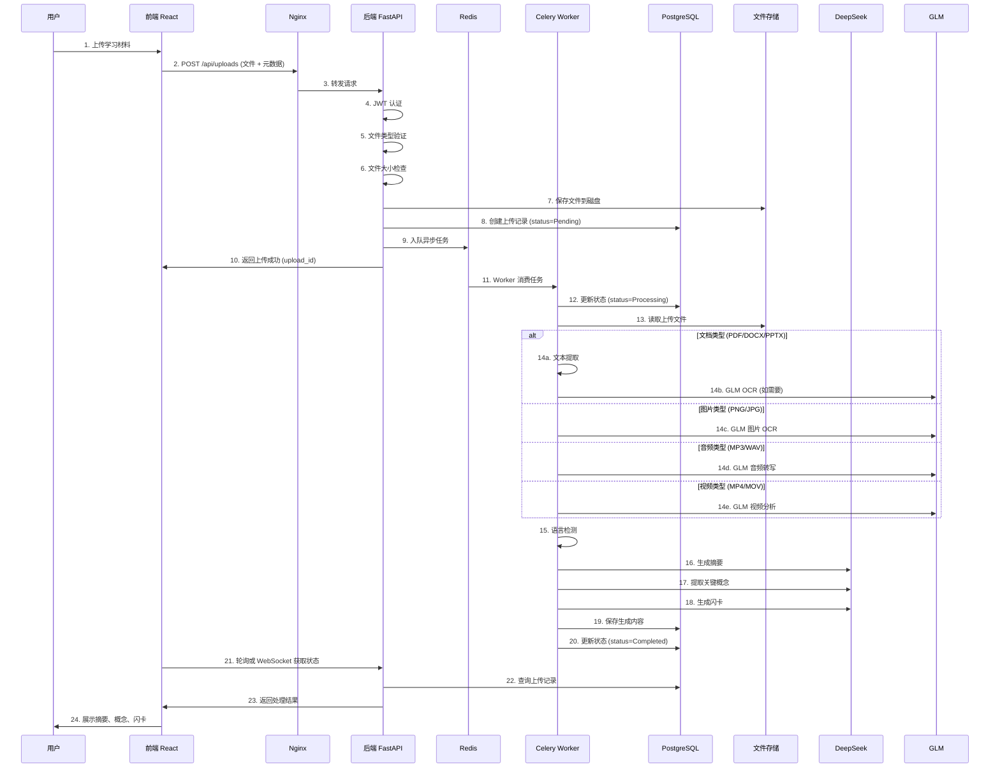
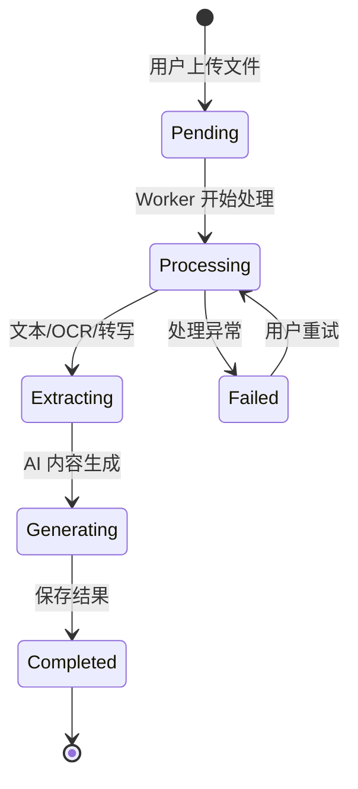

# Smart Study Assistant - 系统架构文档

## 1. 架构概述

本系统采用前后端分离的架构设计。用户通过浏览器访问前端界面，前端基于 React、Vite、Tailwind CSS 与图表组件实现学习材料上传、统计展示、知识卡片与交互页面；所有业务请求经由 REST API 发送到后端 FastAPI 服务。

后端负责用户认证、文件上传、数据管理与 AI 能力编排，并通过 JWT、限流、文件校验与输入清洗实现基础安全控制。结构化数据主要存储在 PostgreSQL 中，包括用户、上传记录、摘要、概念、闪卡及协作数据等；异步任务通过 Redis 作为消息中间件，由 Celery Worker 处理耗时操作，例如文件解析、文本提取、OCR、音频转写与内容生成。

对于不同类型的学习材料，系统先完成 PDF、PPTX、DOCX、图片或音频的文本抽取，再调用大模型生成摘要、关键知识点、闪卡、问答结果和学习路径，从而将非结构化学习资料转换为可复习、可追踪、可共享的学习内容。

整体上，该架构兼顾了交互响应速度、异步处理能力、数据持久化能力以及后续模型服务替换和功能扩展的可维护性。

## 2. 系统架构图

### 2.1 整体架构图

```mermaid
graph TB
    subgraph "客户端层 Client Layer"
        Browser[浏览器 Browser]
        User[用户 User]
    end
    
    subgraph "前端层 Frontend Layer"
        React[React 18 + Vite]
        Router[React Router]
        UI[Tailwind CSS + 图表组件]
        AuthCtx[认证上下文 AuthContext]
        ThemeCtx[主题上下文 ThemeContext]
    end
    
    subgraph "反向代理层 Reverse Proxy"
        Nginx[Nginx]
    end
    
    subgraph "后端服务层 Backend Service Layer"
        FastAPI[FastAPI 0.115]
        
        subgraph "API 路由模块 API Routes"
            AuthAPI[认证路由 /api/auth]
            UploadAPI[上传路由 /api/uploads]
            ShareAPI[分享路由 /api/share]
            ChatAPI[聊天路由 /api/chat]
            AdminAPI[管理路由 /api/admin]
        end
        
        subgraph "核心模块 Core Modules"
            Security[安全层 Security]
            RateLimit[限流器 Rate Limiter]
            Validator[验证器 Validators]
            Sanitizer[输入清洗 Sanitizer]
        end
        
        subgraph "业务服务层 Business Services"
            AIService[AI 服务 AI Service]
            EmailService[邮件服务 Email Service]
            PermissionService[权限服务 Permission Service]
        end
    end
    
    subgraph "异步处理层 Async Processing Layer"
        Redis[Redis 7<br/>消息队列 Message Broker]
        Celery[Celery 5.4 Worker]
        
        subgraph "异步任务 Async Tasks"
            ProcessTask[文件处理任务]
            ExtractTask[文本提取任务]
            OCRTask[OCR 任务]
            TranscribeTask[音频转写任务]
            GenerateTask[内容生成任务]
        end
    end
    
    subgraph "数据持久层 Data Persistence Layer"
        PostgreSQL[(PostgreSQL 16<br/>关系数据库)]
        FileStorage[文件存储<br/>backend/uploads/]
    end
    
    subgraph "外部 AI 服务层 External AI Services"
        DeepSeek[DeepSeek API<br/>文本生成服务]
        GLM[GLM API Zhipu<br/>多模态服务]
        
        subgraph "DeepSeek 能力"
            DS1[摘要生成]
            DS2[概念提取]
            DS3[闪卡生成]
            DS4[知识图谱]
            DS5[学习路径]
            DS6[问答对话]
        end
        
        subgraph "GLM 能力"
            GLM1[音频转写 ASR]
            GLM2[图片 OCR]
            GLM3[PDF OCR]
            GLM4[视频分析]
        end
    end
    
    User --> Browser
    Browser --> React
    React --> Router
    React --> UI
    React --> AuthCtx
    React --> ThemeCtx
    
    React -->|HTTPS REST API| Nginx
    Nginx --> FastAPI
    
    FastAPI --> AuthAPI
    FastAPI --> UploadAPI
    FastAPI --> ShareAPI
    FastAPI --> ChatAPI
    FastAPI --> AdminAPI
    
    FastAPI --> Security
    FastAPI --> RateLimit
    FastAPI --> Validator
    FastAPI --> Sanitizer
    
    FastAPI --> AIService
    FastAPI --> EmailService
    FastAPI --> PermissionService
    
    FastAPI -->|读写数据| PostgreSQL
    FastAPI -->|存储文件| FileStorage
    FastAPI -->|入队任务| Redis
    
    Redis -->|消费任务| Celery
    Celery --> ProcessTask
    Celery --> ExtractTask
    Celery --> OCRTask
    Celery --> TranscribeTask
    Celery --> GenerateTask
    
    Celery -->|读写数据| PostgreSQL
    Celery -->|读取文件| FileStorage
    
    AIService -->|文本任务| DeepSeek
    Celery -->|文本任务| DeepSeek
    DeepSeek --> DS1
    DeepSeek --> DS2
    DeepSeek --> DS3
    DeepSeek --> DS4
    DeepSeek --> DS5
    DeepSeek --> DS6
    
    Celery -->|媒体任务| GLM
    GLM --> GLM1
    GLM --> GLM2
    GLM --> GLM3
    GLM --> GLM4
```



### 2.2 数据流架构图



## 3. 核心组件详解

### 3.1 前端层 (Frontend Layer)

**技术栈**
- React 18 + Vite
- React Router (路由管理)
- Tailwind CSS (样式框架)
- Recharts (图表可视化)
- Axios (HTTP 客户端)

**核心页面**

| 路由 | 页面组件 | 功能描述 |
|------|---------|---------|
| `/login` | LoginPage | 用户登录与注册 |
| `/` | DashboardPage | 上传管理、课程筛选、状态监控 |
| `/uploads/:id` | UploadDetailPage | 查看摘要、概念、闪卡、问答、知识图谱 |
| `/stats` | StatsPage | 学习统计、热力图、遗忘曲线 |
| `/shared` | SharedPage | 查看分享给我的材料 |
| `/groups` | StudyGroupPage | 学习小组、群聊、共享文件 |
| `/admin` | AdminPage | 管理员控制台 (仅管理员可见) |

**核心组件**

| 组件 | 职责 |
|------|------|
| Navbar | 导航栏、用户菜单、主题切换 |
| ChatPanel | 多轮问答对话界面 |
| CommentSection | 评论区组件 |
| KnowledgeGraph | 知识图谱可视化 (D3.js/Cytoscape) |
| StudyHeatmap | 学习活动热力图 |
| AuthContext | 全局认证状态管理 |
| ThemeContext | 深色/浅色主题管理 |

### 3.2 后端服务层 (Backend Service Layer)

**技术栈**
- FastAPI 0.115
- SQLAlchemy (ORM)
- Pydantic (数据验证)
- JWT (身份认证)
- SlowAPI (API 限流)

**API 路由模块**

| 路由模块 | 端点前缀 | 主要功能 |
|---------|---------|---------|
| auth.py | `/api/auth` | 注册、登录、令牌刷新、密码重置 |
| uploads.py | `/api/uploads` | 上传文件、查询列表、查看详情、重试失败任务、导出 Markdown |
| share.py | `/api/share` | 分享管理、评论、学习小组、群聊 |
| chat.py | `/api/chat` | 多轮问答、知识图谱生成、学习路径生成 |
| admin.py | `/api/admin` | 用户管理、上传管理、系统统计、平台设置 |

**核心模块**

| 模块 | 文件 | 职责 |
|------|------|------|
| 安全层 | core/security.py | JWT 生成与验证、密码哈希 |
| 限流器 | core/rate_limit.py | SlowAPI 配置、端点限流 |
| 验证器 | core/validators.py | 文件类型验证、Magic Number 检查 |
| 输入清洗 | core/sanitize.py | XSS 防护、SQL 注入防护 |
| 数据库 | core/database.py | SQLAlchemy 引擎、会话管理 |
| 配置 | core/config.py | 环境变量加载、系统配置 |

**数据模型 (Models)**

| 模型 | 文件 | 描述 |
|------|------|------|
| User | models/user.py | 用户账户、认证信息 |
| Upload | models/upload.py | 上传记录、处理状态 |
| Summary | models/study_material.py | AI 生成的摘要 |
| KeyConcept | models/study_material.py | 关键概念列表 |
| Flashcard | models/study_material.py | 闪卡问答对 |
| FlashcardReview | models/study_session.py | SM-2 复习记录 |
| Conversation | models/conversation.py | 多轮对话会话 |
| ChatMessage | models/conversation.py | 对话消息记录 |
| Course | models/course.py | 课程分类 |
| Tag | models/tag.py | 标签系统 |
| SharedUpload | models/share.py | 直接分享记录 |
| Comment | models/share.py | 评论 |
| StudyGroup | models/share.py | 学习小组 |
| GroupMember | models/share.py | 小组成员 |
| GroupMessage | models/share.py | 群聊消息 |
| GroupInvite | models/share.py | 小组邀请 |
| JoinRequest | models/share.py | 加入申请 |

### 3.3 异步处理层 (Async Processing Layer)

**技术栈**
- Celery 5.4
- Redis 7 (消息代理)
- Python 异步任务处理

**Celery Worker 任务**

| 任务 | 文件 | 功能描述 |
|------|------|---------|
| process_upload | workers/tasks.py | 主处理流程编排 |
| extract_text_from_pdf | workers/tasks.py | PDF 文本提取 |
| extract_text_from_docx | workers/tasks.py | Word 文档提取 |
| extract_text_from_pptx | workers/tasks.py | PowerPoint 提取 |
| transcribe_audio_glm | workers/tasks.py | 音频转写 (GLM) |
| ocr_image_glm | workers/tasks.py | 图片 OCR (GLM) |
| ocr_pdf_glm | workers/tasks.py | PDF OCR (GLM) |
| process_video_glm | workers/tasks.py | 视频分析 (GLM) |
| generate_summary | workers/tasks.py | 生成摘要 (DeepSeek) |
| generate_concepts | workers/tasks.py | 提取概念 (DeepSeek) |
| generate_flashcards | workers/tasks.py | 生成闪卡 (DeepSeek) |

**处理流程**

```
1. 文件上传 → 2. 入队任务 → 3. Worker 消费
                                    ↓
4. 更新状态 (Processing) ← ─ ─ ─ ─ ─ ┘
                ↓
5. 文件类型判断
                ↓
    ┌───────────┴───────────┐
    ↓                       ↓
PDF/DOCX/PPTX          图片/音频/视频
    ↓                       ↓
文本提取              GLM 多模态处理
    ↓                       ↓
    └───────────┬───────────┘
                ↓
6. 语言检测 (langdetect)
                ↓
7. DeepSeek 内容生成
   - 摘要
   - 关键概念
   - 闪卡
                ↓
8. 保存到 PostgreSQL
                ↓
9. 更新状态 (Completed/Failed)
```

### 3.4 数据持久层 (Data Persistence Layer)

**PostgreSQL 数据库**

数据库名称: `smart_study`
用户: `studyapp`

**核心表结构**

```sql
-- 用户表
users (
    id, username, email, hashed_password, 
    is_active, is_admin, created_at
)

-- 上传记录表
uploads (
    id, user_id, filename, file_type, file_size,
    status, language, course_id, is_shared,
    created_at, updated_at, error_message
)

-- 摘要表
summaries (
    id, upload_id, content, created_at
)

-- 关键概念表
key_concepts (
    id, upload_id, concept, explanation, created_at
)

-- 闪卡表
flashcards (
    id, upload_id, question, answer, 
    difficulty, is_known, created_at
)

-- 闪卡复习记录表 (SM-2)
flashcard_reviews (
    id, flashcard_id, user_id, quality,
    easiness_factor, interval, repetitions,
    next_review_date, reviewed_at
)

-- 对话会话表
conversations (
    id, upload_id, user_id, title, created_at
)

-- 对话消息表
chat_messages (
    id, conversation_id, role, content, created_at
)

-- 课程表
courses (
    id, user_id, name, description, created_at
)

-- 标签表
tags (
    id, user_id, name, created_at
)

-- 分享表
shared_uploads (
    id, upload_id, shared_by_user_id, 
    shared_with_user_id, permission, created_at
)

-- 评论表
comments (
    id, upload_id, user_id, content, created_at
)

-- 学习小组表
study_groups (
    id, name, description, created_by_user_id,
    join_mode, created_at
)

-- 小组成员表
group_members (
    id, group_id, user_id, role, joined_at
)

-- 群聊消息表
group_messages (
    id, group_id, user_id, content, created_at
)
```

**文件存储**

路径: `backend/uploads/`
命名规则: `{user_id}_{timestamp}_{original_filename}`

### 3.5 外部 AI 服务层 (External AI Services)

**DeepSeek API (文本生成)**

模型: `deepseek-v4-flash`
Base URL: `https://api.deepseek.com`

**使用场景**
- 摘要生成 (Summary Generation)
- 关键概念提取 (Key Concept Extraction)
- 闪卡生成 (Flashcard Generation)
- 知识图谱生成 (Knowledge Graph Generation)
- 学习路径生成 (Learning Path Generation)
- 多轮问答对话 (Multi-turn Q&A Chat)

**GLM API / Zhipu (多模态服务)**

Base URL: `https://open.bigmodel.cn/api/paas/v4`

**使用场景**

| 模型 | 用途 |
|------|------|
| glm-asr-2512 | 音频转写 (MP3/WAV) |
| glm-4.6v | 图片 OCR (PNG/JPG/JPEG) |
| glm-ocr | PDF OCR、文档布局解析 |
| glm-4.6v | 视频分析 (音频 + 关键帧) |

## 4. 安全架构

### 4.1 认证与授权

**JWT 认证流程**

```
1. 用户登录 → 2. 验证密码 → 3. 生成 JWT Token
                                    ↓
4. 前端存储 Token ← ─ ─ ─ ─ ─ ─ ─ ─ ┘
                ↓
5. 每次请求携带 Token (Authorization: Bearer <token>)
                ↓
6. 后端验证 Token → 7. 提取用户信息 → 8. 执行业务逻辑
```

**权限控制**

| 权限级别 | 描述 |
|---------|------|
| 匿名用户 | 仅可访问登录页 |
| 普通用户 | 可上传、查看自己的材料、参与分享与小组 |
| 管理员 | 可访问管理控制台、查看所有用户数据 |

### 4.2 安全防护措施

| 防护措施 | 实现方式 |
|---------|---------|
| 密码加密 | bcrypt 哈希 |
| JWT 签名 | HS256 算法 |
| API 限流 | SlowAPI (基于 IP 和用户) |
| 文件类型验证 | Magic Number 检查 |
| 文件大小限制 | 默认 50MB |
| 输入清洗 | HTML 转义、SQL 参数化 |
| CORS 控制 | 仅允许指定前端域名 |
| HTTPS | 生产环境强制 HTTPS |

## 5. 部署架构

### 5.1 本地开发环境

```
开发机器
├── PostgreSQL (本地或 Docker)
├── Redis (本地或 Docker)
├── Backend (uvicorn --reload)
├── Celery Worker (celery worker)
└── Frontend (npm run dev)
```

### 5.2 生产环境 (Docker Compose)

```
Docker Host
├── Nginx 容器 (反向代理)
│   ├── 端口 80/443
│   └── 路由到 Backend + Frontend
├── Frontend 容器 (React 静态文件)
├── Backend 容器 (FastAPI + Gunicorn)
├── Celery Worker 容器
├── PostgreSQL 容器
├── Redis 容器
└── 共享卷 /app/uploads
```

**docker-compose.prod.yml 架构**

```yaml
services:
  nginx:
    - 监听 80/443
    - 转发 /api → backend
    - 转发 / → frontend
  
  frontend:
    - Nginx 静态文件服务
    - 构建产物 /usr/share/nginx/html
  
  backend:
    - FastAPI + Gunicorn
    - 挂载 uploads 卷
  
  worker:
    - Celery Worker
    - 挂载 uploads 卷 (共享)
  
  postgres:
    - 持久化卷
  
  redis:
    - 内存缓存
```

## 6. 数据流详解

### 6.1 上传处理流程



### 6.2 权限检查流程

```
用户请求访问上传详情
        ↓
是否为所有者? ─ Yes → 允许访问
        ↓ No
是否为管理员? ─ Yes → 允许访问
        ↓ No
是否直接分享给该用户? ─ Yes → 允许访问
        ↓ No
是否在共享小组中? ─ Yes → 允许访问
        ↓ No
上传是否为公开? ─ Yes → 允许访问
        ↓ No
拒绝访问 (403)
```

### 6.3 SM-2 复习算法流程

```
用户复习闪卡
        ↓
评分 (0-5)
        ↓
计算新的 EF (Easiness Factor)
        ↓
计算下次复习间隔
        ↓
更新 next_review_date
        ↓
保存复习记录
```

## 7. 扩展性设计

### 7.1 水平扩展能力

| 组件 | 扩展方式 |
|------|---------|
| Frontend | CDN + 多副本 Nginx |
| Backend | 负载均衡 + 多实例 FastAPI |
| Worker | 增加 Celery Worker 实例 |
| PostgreSQL | 主从复制、读写分离 |
| Redis | Redis Cluster |

### 7.2 AI 模型替换

系统设计支持灵活替换 AI 服务提供商：

```python
# services/ai_service.py
def _get_ai_credentials():
    # 可配置切换到其他提供商
    if settings.AI_PROVIDER == "deepseek":
        return deepseek_config
    elif settings.AI_PROVIDER == "openai":
        return openai_config
    # ...
```

### 7.3 存储扩展

- 本地文件存储 → 对象存储 (S3/OSS)
- PostgreSQL → 分库分表
- 添加缓存层 (Redis 缓存热点数据)

## 8. 监控与运维

### 8.1 健康检查

```
GET /api/health
→ {"status": "ok"}
```

### 8.2 日志记录

- FastAPI 访问日志
- Celery Worker 任务日志
- 异常堆栈追踪
- AI API 调用日志

### 8.3 性能指标

| 指标 | 目标 |
|------|------|
| API 响应时间 | < 200ms (P95) |
| 文件上传响应 | < 3s |
| Worker 处理时间 | 视文件大小而定 |
| 数据库查询 | < 100ms |

## 9. 技术栈总结

| 层级 | 技术选型 | 版本 |
|------|---------|------|
| 前端框架 | React | 18+ |
| 构建工具 | Vite | 最新 |
| UI 框架 | Tailwind CSS | 3.x |
| 后端框架 | FastAPI | 0.115 |
| ORM | SQLAlchemy | 2.x |
| 任务队列 | Celery | 5.4 |
| 消息代理 | Redis | 7.x |
| 数据库 | PostgreSQL | 16 |
| 反向代理 | Nginx | 最新 |
| 容器化 | Docker + Docker Compose | 最新 |
| 文本 AI | DeepSeek | v4-flash |
| 多模态 AI | GLM (Zhipu) | 4.6v / ASR-2512 |

## 10. 架构优势

1. **前后端分离**: 前端与后端独立开发、部署、扩展
2. **异步处理**: 大文件处理不阻塞用户界面
3. **模块化设计**: 清晰的分层架构，易于维护
4. **安全可靠**: 多层安全防护，JWT 认证，限流保护
5. **可扩展性**: 支持水平扩展，AI 服务可替换
6. **容器化部署**: Docker 一键部署，环境一致性
7. **AI 能力**: 双模型架构，文本与多模态分工明确

---

**文档版本**: 1.0  
**最后更新**: 2026-04-26  
**维护者**: Smart Study Assistant Team
